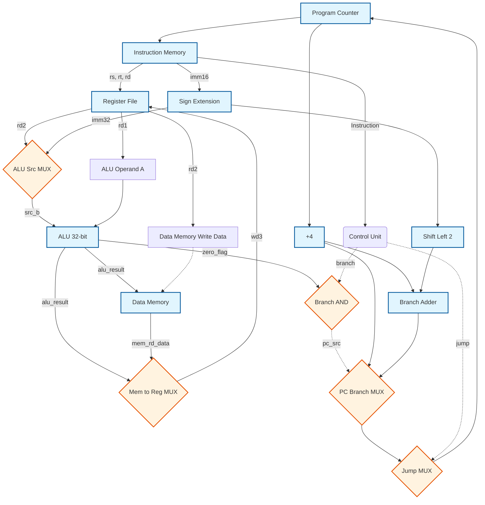

# 32-bit Single-Cycle MIPS Processor (VHDL RTL Implementation)

##  Project Overview
This repository contains a full RTL implementation of a **32-bit Single-Cycle MIPS Processor**, designed from scratch using VHDL. The architecture follows the classic MIPS instruction set, integrating a robust datapath and a central Control Unit to execute instructions in a single clock cycle.

The design is deeply modular, instantiating separate hardware components such as the Arithmetic Logic Unit (ALU), Register File, Data Memory, Instruction Memory, and Program Counter (PC). A comprehensive assembly-level testbench is included to verify the correct execution of arithmetic, logical, memory access, and control flow instructions.

##  Key Features
* **Full MIPS Instruction Set Support:** * **R-Type:** `add`, `sub`, `and`, `or`, `slt`
  * **I-Type:** `addi`, `lw`, `sw`, `beq`
  * **J-Type:** `j` (Jump)
* **Structural VHDL Architecture:** The top module (`mips_processor`) effectively maps and interconnects the datapath logic and control signals, demonstrating strong hierarchical design principles.
* **Integrated Memory Modules:** Features pre-initialized Instruction Memory (ROM) loaded with a test program, and a synchronous Data Memory (RAM) for load/store operations.
* **32-bit ALU:** Capable of performing rapid arithmetic and bitwise operations with zero-flag generation for branch evaluation.
* **Verification via Assembly:** Includes a dedicated testbench (`mips_processor_tb`) that executes a custom assembly program to validate hardware-level state changes, branching, and memory writes.

---

##  Hardware Architecture & Datapath

The following diagram illustrates the high-level datapath routing implemented in the VHDL top module (`mips_processor.vhd`). It shows how data flows between the Program Counter, Memories, Register File, and ALU based on the instruction type.



---

##  Control Unit Logic

The `control_unit` decodes the 6-bit `op_code` and generates the necessary routing flags and ALU operation codes.

| Instruction | OpCode | RegDst | ALUSrc | MemToReg | RegWrite | MemWrite | Branch | ALUOp | Jump |
| :--- | :---: | :---: | :---: | :---: | :---: | :---: | :---: | :---: | :---: |
| **R-Type** | `000000` | 1 | 0 | 0 | 1 | 0 | 0 | `10` | 0 |
| **lw** | `100011` | 0 | 1 | 1 | 1 | 0 | 0 | `00` | 0 |
| **sw** | `101011` | X (0) | 1 | X (0) | 0 | 1 | 0 | `00` | 0 |
| **beq** | `000100` | X (0) | 0 | X (0) | 0 | 0 | 1 | `01` | 0 |
| **addi** | `001000` | 0 | 1 | 0 | 1 | 0 | 0 | `00` | 0 |
| **j** | `000010` | X (0) | X (0) | X (0) | 0 | 0 | 0 | `XX` | 1 |

---

##  Simulation & Assembly Verification
The project is verified using a simulated assembly program hardcoded into the `instruction_memory.vhd` array. 

### Assembly Test Program (`mips_processor_tb.vhd`)
The testbench executes the following logic to confirm arithmetic accuracy, memory loading/storing, and conditional/unconditional jumping:

```assembly
      addi $t0, $zero, 5      # $t0 = 5
      addi $t1, $zero, 10     # $t1 = 10
      add  $t2, $t0, $t1      # $t2 = 15
      sub  $t3, $t1, $t0      # $t3 = 5
      or   $t4, $t0, $t1      # $t4 = 15
      and  $t5, $t0, $t1      # $t5 = 0
      slt  $t6, $t0, $t1      # $t6 = 1 (Since 5 < 10)
      sw   $t2, 0($zero)      # Memory[0] = 15
      lw   $t7, 0($zero)      # $t7 = Memory[0] = 15
      beq  $t7, $t2, SKIP     # Branch taken since 15 == 15
      addi $s0, $zero, 999    # (Instruction Skipped)
      j    DONE               # (Jumps to Done branch)
      addi $s1, $zero, 888    # (Instruction Skipped)
DONE: addi $s2, $zero, 777    # $s2 = 777 (Execution resumes here)
```

